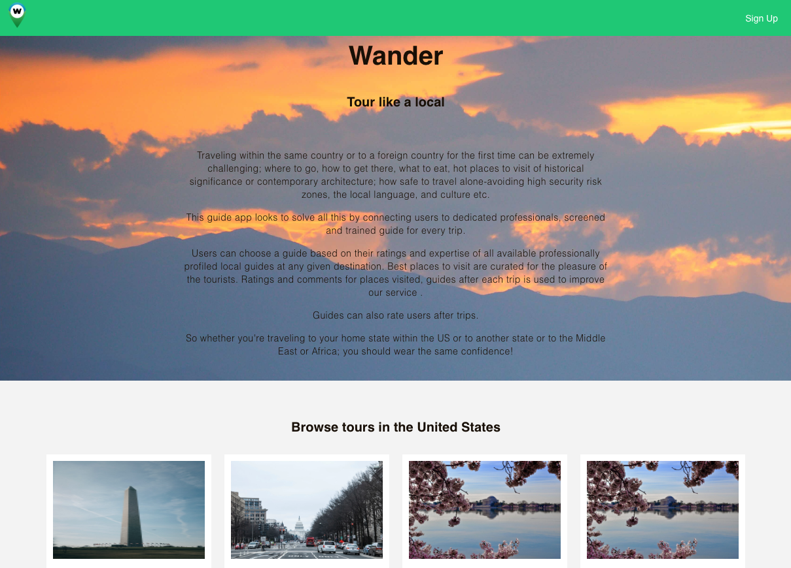
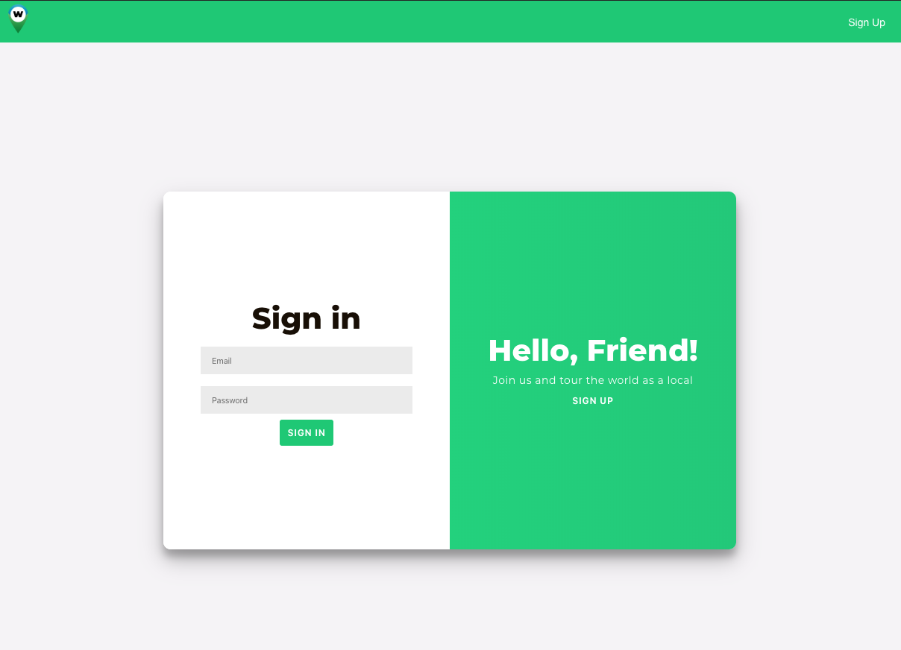
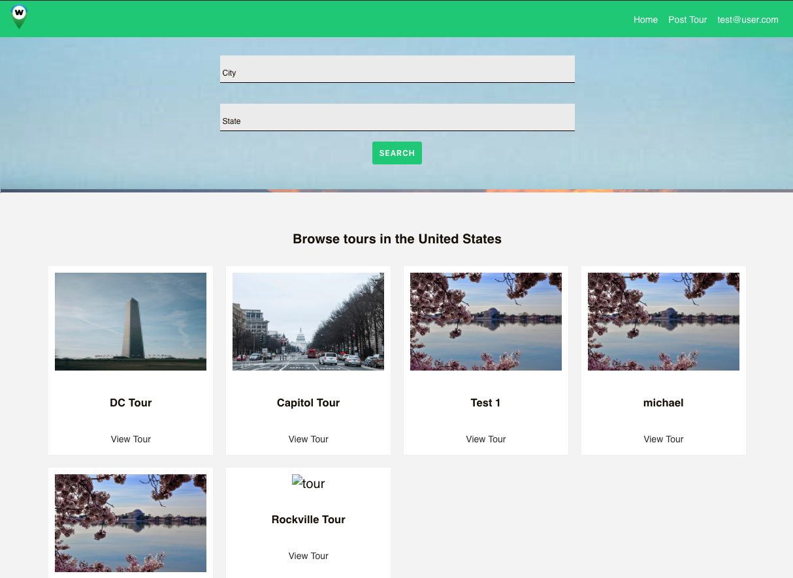
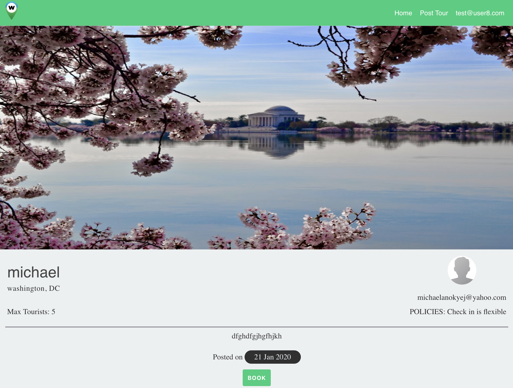
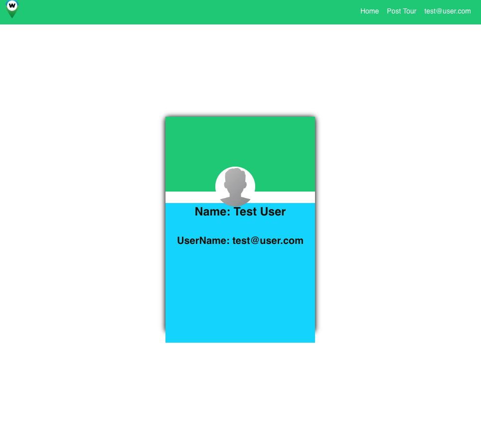
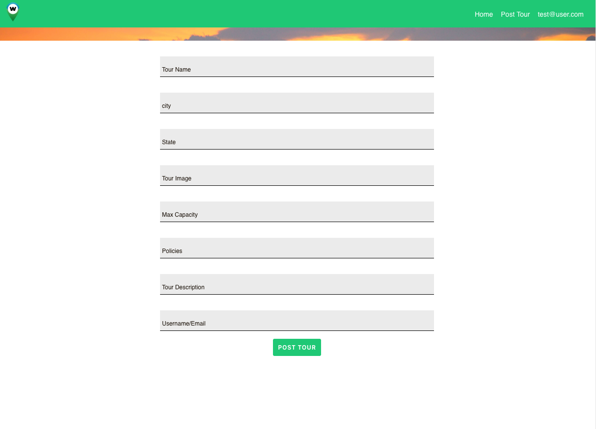

# Wander App

## Why Wander?

> Traveling within the same country or to a foreign country for the
> first time can be extremely challenging; where to go, how to get
> there, what to eat, hot places to visit of historical significance or
> contemporary architecture; how safe to travel alone-avoiding high
> security risk zones, the local language, and culture etc.
> This guide app looks to solve all this by connecting users to
> dedicated professionals, screened and trained guide for every trip.
> Users can choose a guide based on their ratings and expertise of all
> available professionally profiled local guides at any given
> destination. Best places to visit are curated for the pleasure of the
> tourists. Ratings and comments for places visited, guides after each
> trip is used to improve our service . Guides can also rate users after trips.
> So whether you're traveling to your home state within the US or to
> another state or to the Middle East or Africa; you should wear the
> same confidence!

#### Technology Used

> React, JavaScript, CSS, Enzyme, Jest, NPM, RESTFul API
> [Try out Wander](https://wander-client.michaelanokyej.now.sh/ "Link to Wander App Landing page").

## Welcome Screen

> Wander welcomes you with a screen where you can easily browse through all posted tours in the USA.
> > 

### Sign up

> Easily sign up if you are new to the platform or sign in if you are already a user; all in one place.
> 

### Homescreen

> Easily browse and search through tours. You also have a link to post a tour or your profile page.
> 

### Tour Screen

> Easily view more details such as description and guide name about a tour.
> 

### Profile 

> Easily browse profile for profile for user information.
> 

### Post Tour 

> Easily post a tour. Please use this test image when posting a tour https://source.unsplash.com/oN_cUY1v7hs or add any imageId from unsplash.com to https://source.unsplash.com/
> 